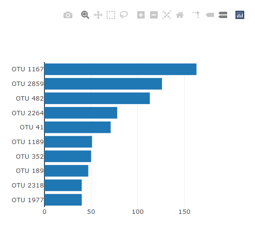
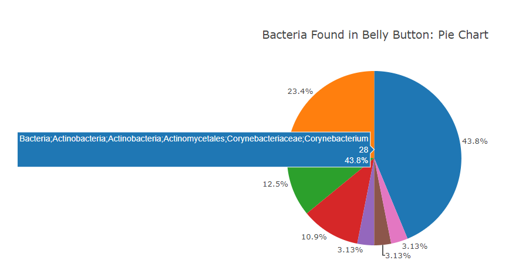

# Belly Button Biodiversity- Plotly

I built an interactive [Belly Button Biodiversity Dashboard](https://ssimoes48.github.io/Biodiversity-Plotly/) to explore the [Belly Button Biodiversity dataset](http://robdunnlab.com/projects/belly-button-biodiversity/) which catalogs the microbes that colonize human navels.

The dataset reveals that a handful of microbial species (also called operational taxonomic units, or OTUs, in the study) were present in more than 70% of people, while the rest were relatively rare.

## Table of contents
* [Technologies](#technologies) 
* [Initiate Page](#initiate-page)
* [Build MetaData](build-metadata)
* [Build Charts](#build-charts)
* [Wash Gauge](#wash-gauge)
* [Resources](#resources)
* [Contact](#contact)

## Technologies 
* JavaScript
* HTML
* Plotly for Javascript
* Json

## Initiate Page 

To load the Belly Button Dashboard website, I created a function Javascript that reads the `Json` data and initiates the functions that build the charts shown on page. The code uses the value selected from the Test Subject ID drop down. The opening page loads with the first Test Subject ID data. 

When you open the Belly Button Dashboard website, it displays: 

* Test subjects’ demographic data
* Horizontal bar chart of OUT data 
* Gauge of how many times the test subject washes their belly button per week
* Bubble chart of bacteria found in the test subjects belly button
* Pie Chart of bacteria found in the test subjects belly button 

## Build MetaData

To display the test subjects’ meta data information in the demographic box, I created a function that reads and filters the `Json` data by test subject ID and displays the key/value pair of data. 

The Demographic Info box displays:

## Build Charts

To build the charts displayed on the Belly Button Dashboard, I developed a function that creates 3 different charts based on which test subjects’ ID is selected from the drop-down menu. I used `ploty` for Javascript to create the charts. 

For the bar chart, I specified x axis to be the sample data values and the y axis to be the sample out ids (bacteria types). In order to make the data in descending order, I used the `.slice` method and then ordered the data in reverse. The orientation of the chart is `h` for horizontal. When you hover over the bars, the full information is displayed. 

The horizontal bar chart of OUT data displays: 

For the bubble chart, I used the sample OUT ids for x axis and the sample values for the y axis. For the markers I used the sample value for the size of the markers and the sample ID for the color. To make the chart interesting, I used a colorscale of `Picnic`. When you hover over the bubbles the full data displays. 

The bubble chart displays:

I also created a pie chart to show the same data as the bubble chart but as a pie chart so one can clearly see the ratio and scale of the different types of bacteria. For test subjects with many different types of bacteria, it is hard to see the information on the pie slices, but if you hover over the slices, the full data displays. 

## Wash Gauge 

The wash gauge displays the wash frequency of each test subject. The number of washes ranges between 0-9 scrubs per week. To create the gauge, I followed the documentation on `ploty` but I created the custom color scale from scratch. Each section of the gauge represents 1 wash.
 

The wash gauge displays: 

## Resources 

[Belly Button Biodiversity Dashboard](https://ssimoes48.github.io/Biodiversity-Plotly/)

[Belly Button Biodiversity dataset](http://robdunnlab.com/projects/belly-button-biodiversity/)

## Contact

[Sara Simoes](https://github.com/Ssimoes48)
