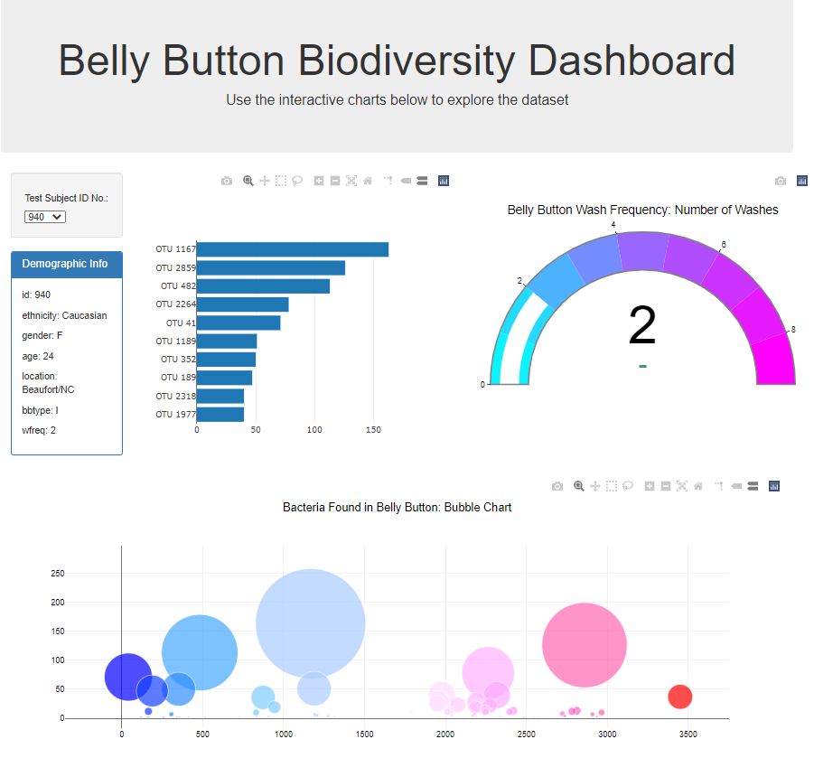
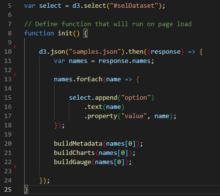
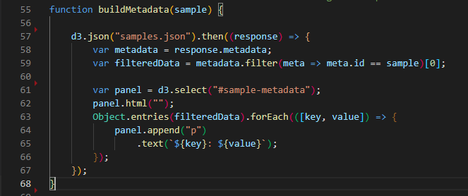
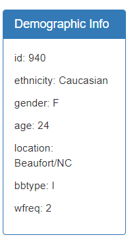
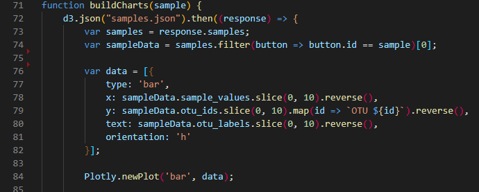
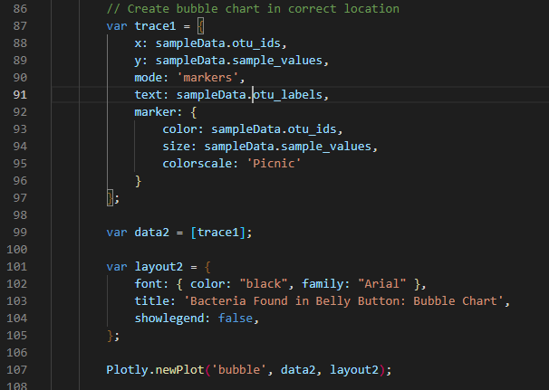
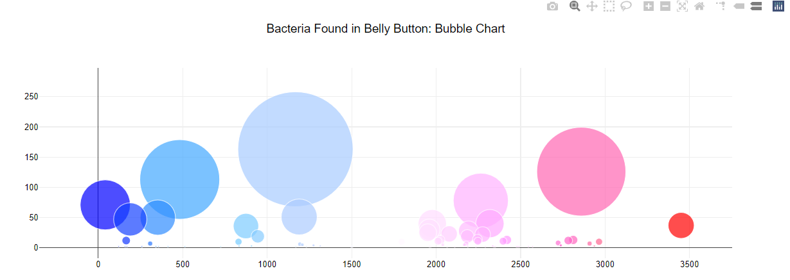
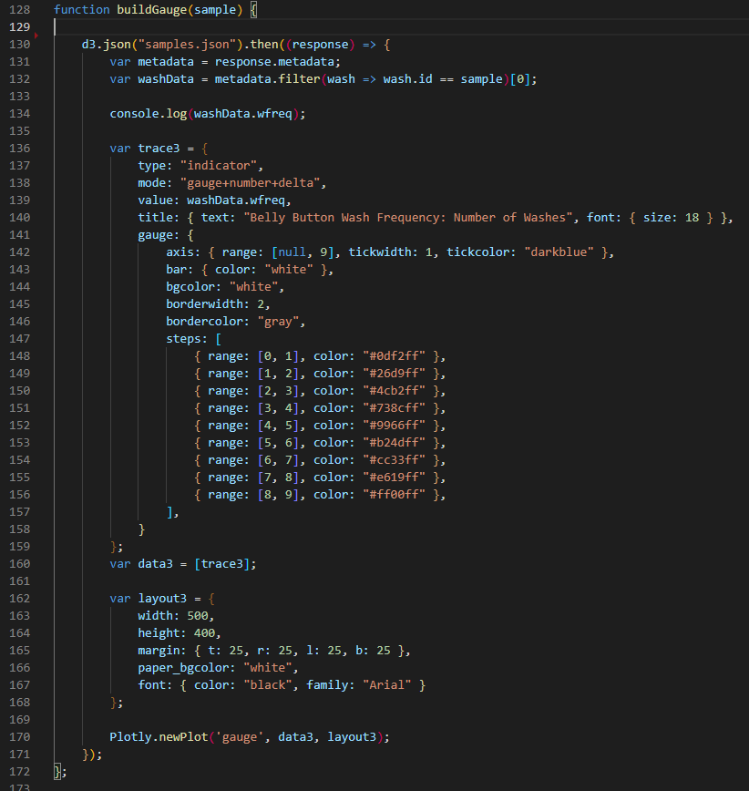
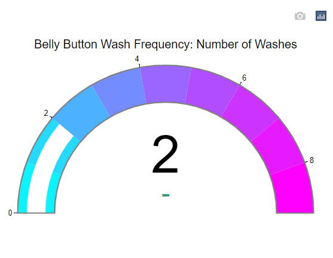

# Biodiversity-Plotly

## Table of contents
* [General info](#general-info)
* [Technologies](#technologies) 
* [Initiate Page](#initiate-page)
* [Build MetaData](build-metadata)
* [Build Charts](#build-charts)
* [Wash Gauge](#wash-gauge)
* [Resources](#resources)
* [Contact](#contact)

## General info

I have built an interactive [Belly Button Biodiversity Dashboard](https://ssimoes48.github.io/Biodiversity-Plotly/) to explore the [Belly Button Biodiversity dataset](http://robdunnlab.com/projects/belly-button-biodiversity/) which catalogs the microbes that colonize human navels.

The dataset reveals that a small handful of microbial species (also called operational taxonomic units, or OTUs, in the study) were present in more than 70% of people, while the rest were relatively rare.
## Technologies 
* JavaScript
* HTML
* Plotly for Javascript
* Json

## Initiate Page 

## Build MetaData

## Build Charts

## Wash Gauge 

## Resources 

[Belly Button Biodiversity Dashboard](https://ssimoes48.github.io/Biodiversity-Plotly/)

[Belly Button Biodiversity dataset](http://robdunnlab.com/projects/belly-button-biodiversity/)

## Contact

[Sara Simoes](https://github.com/Ssimoes48)
